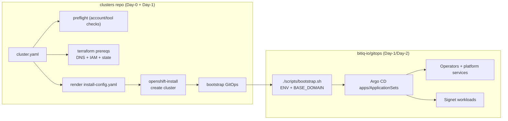
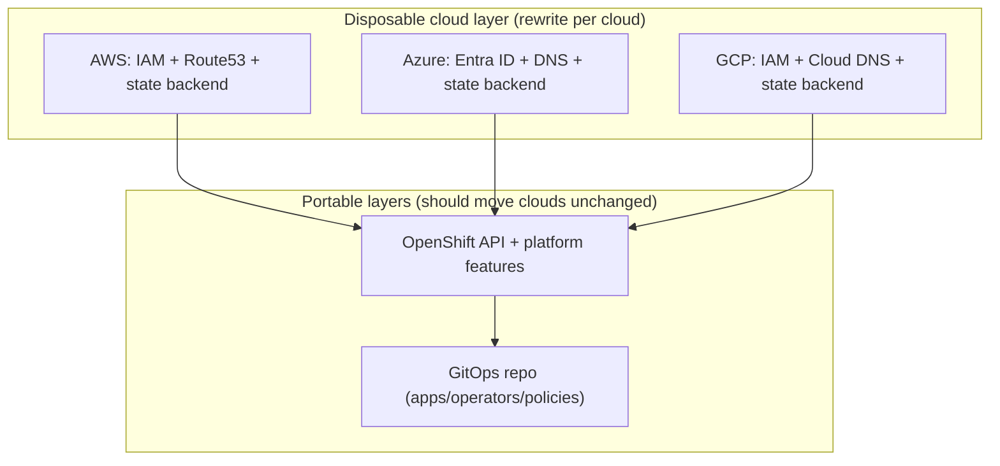

# Signet clusters

Day‑0 OpenShift cluster provisioning + Day‑1 GitOps handoff.

This repo creates/destroys OpenShift clusters (starting with AWS) and then bootstraps the existing GitOps repo (`bitiq-io/gitops`) onto the cluster so Day‑2 operations are fully GitOps-driven.

---

## What lives where

| Concern | `clusters` (this repo) | `bitiq-io/gitops` |
|---|---:|---:|
| Cloud prerequisites (DNS, IAM, state backends) | ✅ | ❌ |
| Cluster lifecycle (create/destroy) | ✅ | ❌ |
| Installing OpenShift (AWS IPI via `openshift-install`) | ✅ | ❌ |
| Bootstrap GitOps onto a fresh cluster | ✅ | ✅ (via `scripts/bootstrap.sh`) |
| Node pools (MachineSets, labels/taints, autoscaling) | ⚠️ bootstrap-only | ✅ |
| Operators, namespaces, policies, workloads | ❌ | ✅ |
| Day‑2 ops (rollouts, upgrades, drift control) | ❌ | ✅ |

The guiding idea: **don’t “abstract” clouds—isolate them**. The portable platform is OpenShift + GitOps; the cloud layer is thin scaffolding that we can throw away when credits/constraints change.

---

## Quick start

### 0) Prereqs

Local tools:

- `aws` CLI v2
- `terraform` (or OpenTofu, but start with Terraform for compatibility)
- `oc`
- `openshift-install` (matching your target OCP version)
- `helm`
- `jq`
- `yq` (recommended; scripts assume it unless we replace with a small Go helper)
- `go` (used to install the `jv` JSON-schema validator)
- `ccoctl` (required for `cco_mode: manual-sts`)

Schema validation uses `jv` and will install it into `.tools/bin` automatically if missing.

You also need:

- A Red Hat pull secret (JSON)  
- An SSH public key for node access

### 1) Clone repos

```bash
git clone https://github.com/bitiq-io/clusters.git
cd clusters
```

You should also have:

```bash
git clone https://github.com/bitiq-io/gitops.git ../gitops
```

(Our bootstrap step will clone automatically too, but having it nearby makes debugging easier.)

### 2) Configure AWS profile for Signet

**Guardrail target AWS account:** `153526447089`

```bash
export AWS_PROFILE=signet
aws sts get-caller-identity
# Account must be 153526447089
```

If this prints a different account, stop. Fix your AWS profile before proceeding.

### 3) Create a cluster definition

Copy the example:

```bash
cp -r clusters/_example/aws-single-az clusters/signet-aws-prod
```

Edit:

- `clusters/signet-aws-prod/cluster.yaml`

### 4) Put secrets in the expected place

```bash
mkdir -p secrets/signet-aws-prod
cp /path/to/pull-secret.json secrets/signet-aws-prod/pull-secret.json
cp ~/.ssh/id_ed25519.pub secrets/signet-aws-prod/ssh.pub
```

These are **gitignored**. Never commit them.

### 5) Run the workflow

```bash
export CLUSTER=signet-aws-prod

# GitOps repo is private: export Argo CD repo credentials before bootstrap
export GITOPS_REPO_USERNAME=<github-username>
export GITOPS_REPO_PASSWORD=<github-pat>

make preflight        CLUSTER=$CLUSTER
make quotas           CLUSTER=$CLUSTER   # EC2 vCPU quota/usage sanity-check
make tf-bootstrap     CLUSTER=$CLUSTER   # one-time per AWS account (state bucket)
make tf-apply         CLUSTER=$CLUSTER   # DNS + IAM prereqs
make cluster-create   CLUSTER=$CLUSTER   # openshift-install create cluster
make bootstrap-gitops CLUSTER=$CLUSTER   # runs gitops/scripts/bootstrap.sh
make verify           CLUSTER=$CLUSTER
```

### 6) Use the cluster

After `cluster-create`, the kubeconfig lives at:

- `clusters/<cluster>/.work/kubeconfig` (this repo’s normalized output)
- The installer’s original kubeconfig also exists under `clusters/<cluster>/.work/installer/auth/kubeconfig`
- The kubeadmin password is written by the installer to `clusters/<cluster>/.work/installer/auth/kubeadmin-password`

Example:

```bash
export KUBECONFIG=clusters/signet-aws-prod/.work/kubeconfig
oc get nodes
```

Dashboard URLs (OpenShift defaults):

- Apps base domain: `apps.<cluster>.<dns.base_domain>`
- OpenShift Console: `https://console-openshift-console.apps.<cluster>.<dns.base_domain>`
- Argo CD (OpenShift GitOps): `https://openshift-gitops-server-openshift-gitops.apps.<cluster>.<dns.base_domain>`
- OAuth: `https://oauth-openshift.apps.<cluster>.<dns.base_domain>`
- Prometheus: `https://prometheus-k8s-openshift-monitoring.apps.<cluster>.<dns.base_domain>`
- Alertmanager: `https://alertmanager-main-openshift-monitoring.apps.<cluster>.<dns.base_domain>`
- Grafana: `https://grafana-openshift-monitoring.apps.<cluster>.<dns.base_domain>`
- Thanos Query: `https://thanos-querier-openshift-monitoring.apps.<cluster>.<dns.base_domain>`
- API server: `https://api.<cluster>.<dns.base_domain>:6443`

Prod cluster links (current):

- OpenShift Console: `https://console-openshift-console.apps.prod.aws.ocp.signet.ing`
- Argo CD (OpenShift GitOps): `https://openshift-gitops-server-openshift-gitops.apps.prod.aws.ocp.signet.ing`
- OAuth: `https://oauth-openshift.apps.prod.aws.ocp.signet.ing`
- Prometheus: `https://prometheus-k8s-openshift-monitoring.apps.prod.aws.ocp.signet.ing`
- Alertmanager: `https://alertmanager-main-openshift-monitoring.apps.prod.aws.ocp.signet.ing`
- Grafana: `https://grafana-openshift-monitoring.apps.prod.aws.ocp.signet.ing`
- RHOAI (OpenShift AI): `https://data-science-gateway.apps.prod.aws.ocp.signet.ing`
- Thanos Query: `https://thanos-querier-openshift-monitoring.apps.prod.aws.ocp.signet.ing`
- API server: `https://api.prod.aws.ocp.signet.ing:6443`

If a route does not resolve yet, list the actual routes:

```bash
KUBECONFIG=clusters/<cluster>/.work/kubeconfig oc get route -A
```

---

## Architecture

### Provisioning + handoff flow



### “Thin cloud layer” strategy



---

## Repository structure

```text
.
├── clusters/
│   ├── _example/
│   │   └── aws-single-az/
│   │       ├── cluster.yaml
│   │       └── install-config.yaml.tmpl
│   └── signet-aws-prod/
│       ├── cluster.yaml
│       ├── install-config.yaml.tmpl
│       └── .work/                  # generated (install-config, kubeconfig, terraform outputs)
├── secrets/
│   └── <cluster>/                  # pull-secret.json, ssh.pub (gitignored)
├── platforms/
│   └── aws/
│       └── terraform/
│           ├── bootstrap/          # one-time account setup (state bucket)
│           └── prereqs/            # per-cluster prereqs (DNS, IAM)
├── scripts/
│   ├── preflight.sh
│   ├── validate.sh
│   ├── tf-bootstrap.sh
│   ├── tf-apply.sh
│   ├── render-install-config.sh
│   ├── cco-manual-sts.sh
│   ├── cluster-create.sh
│   ├── cluster-destroy.sh
│   ├── bootstrap-gitops.sh
│   └── verify.sh
├── schemas/
│   └── cluster.schema.json
├── docs/
│   ├── ARCHITECTURE.md
│   ├── CCO_MANUAL_STS.md
│   └── TROUBLESHOOTING.md
├── Makefile
└── README.md
```

---

## The cluster contract: `cluster.yaml`

`clusters/<name>/cluster.yaml` is the **single source of truth** for cluster intent.

Example (AWS, single-AZ):

```yaml
name: signet-aws-prod
env: prod

platform:
  type: aws
  account_id: "153526447089"
  region: us-west-2
  zones: ["us-west-2a"]  # single AZ default to avoid cross-AZ transfer costs

dns:
  # We recommend delegating a per-cloud subdomain (e.g. aws.ocp.signet.ing) for portability.
  # Keep the root domain provider-neutral; switching clouds becomes a subdomain change.
  base_domain: aws.ocp.signet.ing
  # If you manage the zone elsewhere, you can set hosted_zone_id and skip creation.
  # hosted_zone_id: "Z123..."

openshift:
  version: "4.20"
  control_plane_replicas: 3
  compute_replicas: 2
  instance_type_control_plane: m6i.large
  instance_type_compute: m6i.xlarge
  compute_market: on-demand  # on-demand (default) | spot

credentials:
  aws_profile: signet
  cco_mode: mint   # mint (MVP) | manual-sts (experimental)

gitops:
  repo_url: "https://github.com/bitiq-io/gitops.git"
  repo_ref: "main"
  env: prod
```

---

## Guardrails and safety

This repo is designed to prevent expensive mistakes:

- **Account hard check:** scripts fail if `aws sts get-caller-identity` does not match `cluster.yaml: platform.account_id`.
- **Terraform guardrail:** Terraform AWS provider uses `allowed_account_ids = [platform.account_id]`.
- **Quota sanity-check:** `cluster-create` and `spot-workers` run `make quotas` to fail fast if EC2 vCPU quotas/usage lack headroom (override with `SKIP_QUOTAS=1`).
- **No secrets in git:** pull secret, ssh keys, kubeconfig, kubeadmin password, and install logs are all gitignored.
- **Destructive actions require confirmation:** `cluster-destroy` prompts you to type the cluster name and runs a post-destroy AWS cleanup report.

---

## AWS notes

### Single-AZ vs multi-AZ

We default to **single-AZ** for cost control. Multi-AZ costs often show up as cross-AZ data transfer (control plane replication + service traffic + app chatter). When uptime needs win over cost, switch to multi-AZ by setting multiple zones in `cluster.yaml`.

GPU capacity exception: AWS GPU instance capacity can be constrained in a single AZ. In that case, keep `cluster.yaml` single-AZ for baseline control plane/workers, but add GPU-only private subnets in additional AZs and manage GPU MachineSets in GitOps (`bitiq-io/gitops`). This preserves the single-AZ cost profile for baseline workloads while allowing GPU capacity to scale, at the cost of cross-AZ traffic (NAT egress and control-plane chatter).

### DNS

We recommend delegating per-cloud subdomains rather than moving the root domain. Examples:
`aws.ocp.signet.ing`, `gcp.ocp.signet.ing`, `az.ocp.signet.ing`. This keeps the root
domain provider-neutral and makes cloud changes a DNS delegation change. For AWS IPI installs,
plan for Route53 public DNS ownership of the delegated subdomain (this repo can manage the hosted
zone, or you can point at an existing one via `hosted_zone_id`).

### Credentials

MVP uses `cco_mode: mint` for simplicity. `manual-sts` is available as a prototype and still needs real-cluster validation.

### Node pools (MachineSets)

- The OpenShift installer creates the baseline worker MachineSets. This repo may patch them for Spot via `make spot-workers`.
- Additional/specialized pools (GPU, infra, storage, etc.) and their scheduling policy (labels/taints) are managed in `bitiq-io/gitops` so Argo CD can reconcile drift.
- MachineSets are cluster-specific (they embed the installer `infraID` in names/tags); if you manage them in GitOps, template/inject `infraID` during bootstrap.

---

## Make targets

| Target | Purpose |
|---|---|
| `make preflight` | verify tools + verify AWS account |
| `make validate` | validate `cluster.yaml` against JSON schema |
| `make quotas` | report/check AWS EC2 vCPU quotas (cluster instance types) |
| `make quotas-all` | report/check AWS EC2 vCPU quotas (all clusters; includes full limit listing) |
| `make tf-bootstrap` | one-time: create state bucket/backend |
| `make tf-apply` | per cluster: DNS + IAM prereqs |
| `make tf-destroy` | destroy per cluster: DNS + IAM prereqs (preserves hosted zone by default) |
| `make cco-manual-sts` | prepare AWS STS IAM/OIDC resources (manual CCO mode) |
| `make cluster-create` | create OCP cluster via `openshift-install` |
| `make bootstrap-gitops` | call `bitiq-io/gitops/scripts/bootstrap.sh` |
| `make spot-workers` | patch/scale worker MachineSets to Spot (AWS) |
| `make verify` | health checks (nodes, operators, gitops) |
| `make cluster-destroy` | destroy cluster via `openshift-install destroy` |
| `make cleanup-check` | report remaining AWS resources tagged to the cluster |

---

## Runbooks

For a cloud-agnostic workflow with provider-specific sections, see:

- `docs/RUNBOOK.md`
- `docs/TROUBLESHOOTING.md`
- `docs/ARCHITECTURE.md`

---

## Troubleshooting (short version)

- **“Wrong AWS account”**: set `AWS_PROFILE=signet` and rerun `make preflight`.
- **DNS doesn’t resolve yet**: hosted zone delegation can take time; verify NS records.
- **Installer failed mid-run**: run `make cluster-destroy`, fix the cause, retry.
- **GitOps bootstrap fails**: confirm `gitops/scripts/bootstrap.sh` runs manually with:
  `ENV=prod BASE_DOMAIN=apps.<cluster>.<base_domain> ./scripts/bootstrap.sh`

More in `docs/TROUBLESHOOTING.md`.

---

## Roadmap

- Validate `cco_mode: manual-sts` on a throwaway cluster (see `docs/CCO_MANUAL_STS.md`).
- Azure and GCP implementations under `platforms/azure` and `platforms/gcp`.
- Agent-based installer support for on-prem / airgapped environments.

---

## References

- OpenShift 4.20 install on AWS: https://docs.redhat.com/en/documentation/openshift_container_platform/4.20/html-single/installing_on_aws/index
- OpenShift cloud credentials (CCO): https://docs.redhat.com/en/documentation/openshift_container_platform/4.20/html/authentication_and_authorization/managing-cloud-provider-credentials
- GitOps bootstrap repo: https://github.com/bitiq-io/gitops (see `./scripts/bootstrap.sh`)
